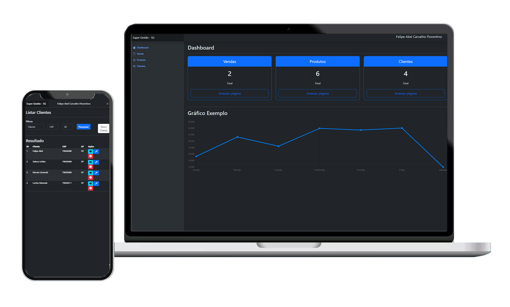

## Sobre o Sistema Super Gestão - SG

O sistema Super Gestão - SG trata-se de um website responsável por gerenciar Produtos, Clientes e Vendas. Com isso, pode-se esperar funcionalidades como CRUD (Create, Read, Update, Delete), não somente isso, mas também Filtros, Envio de E-mails, Recuperação de dados de Endereço após preenchimento do CEP, entros recursos. 

Destaca-se, que o objetivo principal não foi elaborar um sistema robusto com diversas funcionalidades e um banco de dados de igual maguinitude. E sim, consolidar meus estudos e apresentar o meu código limpo, claro e com boas práticas utilizando o framework Laravel.

### Algumas Telas do SG

- Dasboard [IMG](public/img/github/dasboard.png)
- Listar Produto [IMG](public/img/github/listar-produto.png)
- Cadastro de Cliente [IMG](public/img/github/cadastro-cliente.png)
- Comprovante de E-mail Enviado [IMG](public/img/github/comprovante-email.png)

## Tecnologias utilizadas

### 

O Sistema SG foi desenvolvido em Laravel, abaixo listo os principais componentes e como foram utilizados: 

- **[Laravel Versão 8.x](https://laravel.com/docs/8.x)**
- **[The Basics: Controllers](https://laravel.com/docs/8.x/controllers)**
-- Em regra, foram utilizados as estruturas de Resource.
- **[The Basics: Validation](https://laravel.com/docs/8.x/validation)**
-- Validação dos campos do formulário antes de salvar/alterar as informações no banco de dados "Form Request".
- **[Database: Seeding](https://laravel.com/docs/8.x/seeding)**
-- Criação de registro nas tabelas.
- **[Blade Templates](https://laravel.com/docs/8.x/blade)**
-- Front-End utilizando os recursos do Blade "Extends, Section, Yield, Component, Include".
- **[Mail](https://laravel.com/docs/8.x/mail)**
-- Notificação de e-mail para o usuário.
- **[Eloquent ORM: Collections](https://laravel.com/docs/8.x/eloquent-collections)**
-- Recuperação de dados com o Eloquent ORM.
- **[Consulta do CEP através do VIACep Api](https://viacep.com.br/)**
-- Recuperação de dados de endereço utilizando o CEP.

### Sistema de Gerenciameto de Bando de Dados - SGBD
O Banco de Dados utilizado foi o [MySQL Workbench](https://www.mysql.com/products/workbench/).

### Composer
Gerenciador de dependências do PHP. Necessário ter instalado para atualizações e inclusões de novos pacotes no sistema.
([Documentação](https://getcomposer.org/))

### Bootstrap
[Bootstrap 5.3](https://getbootstrap.com/) é o template utilizado no Front-End.

## Construção do Ambiente Local

Para configurar o ambiente local do Sistema SG, é essecial seguir o passo a passo abaixo:

    1. Faça o clone do projeto via git;
    2. Usando o cmd ou terminal, vá até a pasta do onde clonou o projeto;
    3. Execute 'composer install';
    4. Faça uma cópia do arquivo '.env.example' para '.env' na pasta do projeto. Pode-se usar para Windows: 'copy .env.example .env', ou, 'cp .env.example .env', para Ubuntu;
    5. Execute o comando 'php artisan key:generate';
    6. Abra o arquivo .env e altere, variável do valor contido em 'DB_DATABASE=laravel' para 'DB_DATABASE=bd_super_gestao';
    7. Abra o phpMyAdmin local ('http://localhost/phpmyadmin') ou SGBD de sua preferência;
    8. Crie um novo banco de dados com o nome 'bd_super_gestao';
    9. Execute o comando 'php artisan migrate' para criar as tabelas;
    10. Execute o comando 'php artisan db:seed' para carregar os dados nas tabelas;
    11. Execute o comando 'php artisan serve' ou 'php artisan serve --port=9090';
    12. Acesse em seu navegador o endereço ('http://127.0.0.1:8000/'), Padrão Laravel, ou ('http://127.0.0.1:9090/'), com o comando de porta 9090.
    
Para configurar o envio de e-mail do Sistema SG, é essecial seguir o passo a passo abaixo:

    1. Necessário ter uma conta Gmail com autenticação de 2 fatores ativas.
    2. Acesse as configurações de sua conta:
    2.1. Busque por "Senhas de app", geralmente está dentro de "Verificação em duas etapas", crie um registro com o nome Super Gestao - SG, por exemplo. Copie/salve a senha gerada.
    3. Abra o arquivo .env e altere o valor contido na variável:
    3.1 'MAIL_USERNAME=SEU_EMAIL@gmail.com', coloque o e-mail responsável por enviar os e-mails aos usuários.
    3.2 'MAIL_PASSWORD=SENHA_GERADA_GMAIL', coloque a senha gerada do Gmail, não coloque espaços.
    3.3 "MAIL_FROM_ADDRESS='SEU_EMAIL@gmail.com'", repita o e-mail responsável por enviar os e-mails aos usuários entre aspas simples.

## Licença MIT

Este projeto utiliza a licença MIT